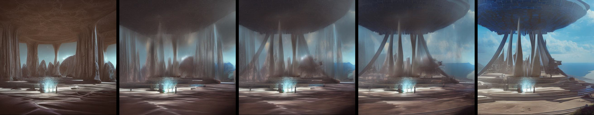

# What is latent blending?

Latent blending enables you to generate super smooth video transitions between prompts. It is based on [stable diffusion 2.1](https://stability.ai/blog/stablediffusion2-1-release7-dec-2022). The key idea is to take the intermediate latent representations and mix them together before further developing them. You can fully specify how this happens or use presets. 

# Quickstart
```python
fp_ckpt = 'path_to_SD2.ckpt'
fp_config = 'path_to_config.yaml'

sdh = StableDiffusionHolder(fp_ckpt, fp_config, 'cuda')
lb = LatentBlending(sdh)

lb.load_branching_profile(quality='medium', depth_strength=0.4)
lb.set_prompt1('photo of my first prompt1')
lb.set_prompt2('photo of my second prompt')

imgs_transition = lb.run_transition()
```
## Gradio UI
To run the UI on your local machine, run `gradio_ui.py`

## Example 1: Simple transition

To run a simple transition between two prompts, run `example1_standard.py`

## Example 2: Inpainting transition

To run a transition between two prompts where you want some part of the image to remain static, run `example2_inpaint.py`

## Example 3: concatenated transition
To run multiple transition between K prompts, resulting in a stitched video, run `example3_multitrans.py`

# Relevant parameters


# Installation
#### Packages
```commandline
pip install -r requirements.txt
```
#### Download Models from Huggingface
[Download the Stable Diffusion v2-1_768 Model](https://huggingface.co/stabilityai/stable-diffusion-2-1)

[Download the Stable Diffusion 2.0 Inpainting Model (optional)](https://huggingface.co/stabilityai/stable-diffusion-2-inpainting)

#### (Optional) Install [Xformers](https://github.com/facebookresearch/xformers)
With xformers, stable diffusion 2 will run a bit faster. The recommended way of installation is via the supplied binaries (Linux).

```commandline
conda install xformers -c xformers/label/dev
```

Alternatively, you can build it from source:
```commandline
# (Optional) Makes the build much faster
pip install ninja
# Set TORCH_CUDA_ARCH_LIST if running and building on different GPU types
pip install -v -U git+https://github.com/facebookresearch/xformers.git@main#egg=xformers
# (this can take dozens of minutes)
```

# How does it work


what makes a transition a good transition?
* absence of movement
* every frame looks like a credible photo
