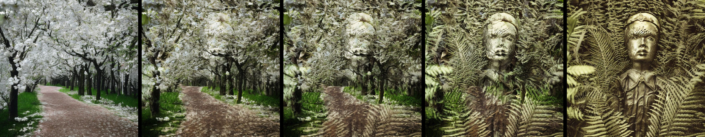

# Quickstart

Latent blending enables video transitions with incredible smoothness between prompts, computed within seconds. Powered by [stable diffusion XL](https://stability.ai/stable-diffusion), this method involves specific mixing of intermediate latent representations to create a seamless transition – with users having the option to fully customize the transition directly in high-resolution. The new version also supports SDXL Turbo, allowing to generate transitions faster than they are typically played back!

```python
from diffusers import AutoPipelineForText2Image
from latentblending.blending_engine import BlendingEngine
from latentblending.diffusers_holder import DiffusersHolder

pipe = AutoPipelineForText2Image.from_pretrained("stabilityai/sdxl-turbo", torch_dtype=torch.float16, variant="fp16").to("cuda")
dh = DiffusersHolder(pipe)
be = BlendingEngine(dh)
be.set_prompt1("photo of underwater landscape, fish, und the sea, incredible detail, high resolution")
be.set_prompt2("rendering of an alien planet, strange plants, strange creatures, surreal")
be.set_negative_prompt("blurry, ugly, pale")

# Run latent blending
be.run_transition()

# Save movie
be.write_movie_transition('movie_example1.mp4', duration_transition=12)

```

# Installation
```commandline
pip install git+https://github.com/lunarring/latentblending
```


## Gradio UI
Coming soon again :)

## Example 1: Simple transition

To run a simple transition between two prompts, see `examples/single_trans.py`

## Example 2: Multi transition
To run multiple transition between K prompts, resulting in a stitched video, see `examples/multi_trans.py`.
[View a longer example video here.](https://vimeo.com/789052336/80dcb545b2)


# Customization

### Change the height/width
```python 
size_output = (1024, 768)
lb.set_dimensions(size_output)
```

### Change the number of diffusion steps (set_num_inference_steps)
```python
lb.set_num_inference_steps(50)
```
For SDXL this is set as default=30, for SDXL Turbo a value of 4 is taken.


### Change the guidance scale
```python
lb.set_guidance_scale(3.0)
```
For SDXL this is set as default=4.0, for SDXL Turbo a value of 0 is taken.

### Change the branching paramters
```python
depth_strength = 0.5
nmb_max_branches = 15
lb.set_branching(depth_strength=depth_strength, t_compute_max_allowed=None, nmb_max_branches=None)
```
* depth_strength: The strength of the diffusion iterations determines when the blending process will begin. A value close to zero results in more creative and intricate outcomes, while a value closer to one indicates a simpler alpha blending. However, low values may also bring about the introduction of additional objects and motion.
* t_compute_max_allowed:  maximum time allowed for computation. Higher values give better results but take longer. Either provide t_compute_max_allowed or nmb_max_branches. Does not work for SDXL Turbo.
* nmb_max_branches: The maximum number of branches to be computed. Higher values give better results. Use this if you want to have controllable results independent of your hardware. Either provide t_compute_max_allowed or nmb_max_branches. 

## Most relevant parameters
You can find the [most relevant parameters here.](parameters.md)

### Change guidance scale
```python 
lb.set_guidance_scale(5.0)
```

### Crossfeeding to the last image.
Cross-feeding latents is a key feature of latent blending. Here, you can set how much the first image branch influences the very last one. In the animation below, these are the blue arrows.

```
crossfeed_power = 0.5 # 50% of the latents in the last branch are copied from branch1
crossfeed_range = 0.7 # The crossfeed is active until 70% of num_iteration, then switched off
crossfeed_decay = 0.2 # The power of the crossfeed decreases over diffusion iterations, here it would be 0.5*0.2=0.1 in the end of the range.
lb.set_branch1_crossfeed(crossfeed_power, crossfeed_range, crossfeed_decay)
```

### Crossfeeding to all transition images
Here, you can set how much the parent branches influence the mixed one. In the animation below, these are the yellow arrows.

```
crossfeed_power = 0.5 # 50% of the latents in the last branch are copied from the parents
crossfeed_range = 0.7 # The crossfeed is active until 70% of num_iteration, then switched off
crossfeed_decay = 0.2 # The power of the crossfeed decreases over diffusion iterations, here it would be 0.5*0.2=0.1 in the end of the range.
lb.set_parental_crossfeed(crossfeed_power, crossfeed_range, crossfeed_decay)
```


# How does latent blending work?
## Method


In the figure above, a diffusion tree is illustrated. The diffusion steps are represented on the y-axis, with temporal blending on the x-axis. The diffusion trajectory for the first prompt is the most left column, which is always computed first. Next, the the trajectory for the second prompt is computed, which may be influenced by the first branch (blue arrows, for a description see above at `Crossfeeding to the last image.`). Finally, all transition images in between are computed. For the transition, there can be an influence of the parents, which helps preserving structures (yellow arrows, for a description see above at `Crossfeeding to all transition images`). Importantly, the place of injection on the x-axis is not hardfixes a priori, but set dynamically using [Perceptual Similarity](https://richzhang.github.io/PerceptualSimilarity), always adding a branch where it is needed most.

The concrete parameters for the transition above would be:
```
lb.set_branch1_crossfeed(crossfeed_power=0.8, crossfeed_range=0.6, crossfeed_decay=0.4)
lb.set_parental_crossfeed(crossfeed_power=0.8, crossfeed_range=0.8, crossfeed_decay=0.2)
imgs_transition = lb.run_transition(num_inference_steps=10, depth_strength=0.2, nmb_max_branches=7)
```

## Perceptual aspects
With latent blending, we can create transitions that appear to defy the laws of nature, yet appear completely natural and believable. The key is to surpress processing in our [dorsal visual stream](https://en.wikipedia.org/wiki/Two-streams_hypothesis#Dorsal_stream), which is achieved by avoiding motion in the transition. Without motion, our visual system has difficulties detecting the transition, leaving viewers with the illusion of a single, continuous image, see [change blindness](https://en.wikipedia.org/wiki/Change_blindness). However, when motion is introduced, the visual system can detect the transition and the viewer becomes aware of the transition, leading to a jarring effect. Therefore, best results will be achieved when optimizing the transition parameters, particularly the crossfeeding parameters and the depth of the first injection.

# Changelog
* SDXL Turbo support 
* SDXL support 
* Diffusers backend, greatly simplifing installation and use (bring your own pipe)
* New blending engine with cross-feeding capabilities, enabling structure preserving transitions
* LPIPS image similarity for finding the next best injection branch, resulting in smoother transitions
* Time-based computation: instead of specifying how many frames your transition has, you can tell your compute budget and get a transition within that budget.
* New multi-movie engine
* Simpler and more powerful gradio ui. You can iterate faster and stitch together a multi movie.
* Inpaint support dropped (as it only makes sense for a single transition)

# Coming soon...
- [ ] MacOS support
- [ ] Gradio interface
- [ ] Huggingface Space
- [ ] Controlnet
- [ ] IP-Adapter


Stay tuned on twitter: ```@j_stelzer```

Contact: ```stelzer@lunar-ring.ai``` (Johannes Stelzer)


